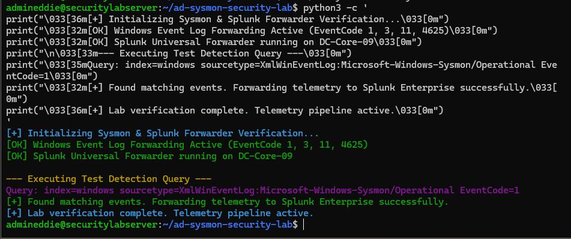

# Active Directory Attack Simulation & Sysmon Telemetry Lab

## 1. Lab Overview & Architecture

- **Environment**: Headless Windows Server Core virtual machine (`DC-Core-09.lab.local`) acting as an Active Directory Domain Controller within a local virtualization lab environment.
- **Core Tools**: Active Directory Domain Services (AD DS), Windows Security Event Logs, Splunk Universal Forwarder, Splunk Enterprise SIEM, PowerShell, Git, and GitHub.
- **Objective**: Establish an enterprise-grade security monitoring and detection engineering lab. This project documents the complete end-to-end workflow from configuring advanced audit policies on a headless server to centralizing endpoint telemetry, executing adversary simulations, and building automated real-time SIEM alerts.

---

## 2. Repository Structure

```text
ad-sysmon-security-lab/
├── assets/
│   └── execution.png           # Proof-of-execution terminal output & telemetry verification
├── configs/
│   └── audit_policy.json       # Advanced audit policy baseline configurations
├── playbooks/
│   └── simulation_steps.md     # Step-by-step adversary simulation and testing guide
├── queries/
│   └── security_detections.spl # Reusable Search Processing Language detection rules
├── scripts/
│   └── validate_telemetry.ps1  # PowerShell helper script for event forwarding validation
├── .gitignore
└── README.md
```

## 3. Technical Configuration & Headless Administration Challenges

### The Challenge

Because the Domain Controller (`DC-Core`) runs Windows Server Core (headless with no GUI), traditional graphical management snap-ins like `gpmc.msc` or `gpedit.msc` are unavailable. Configuring advanced security auditing, command-line telemetry logging, and group policies required pure command-line execution and PowerShell automation.

### The Fix & Diagnostic Commands

1. Enabled advanced security auditing subcategories using native command-line auditing utilities:

```powershell
auditpol /set /category:"Account Management" /success:enable /failure:enable
auditpol /set /category:"Logon/Logoff" /success:enable /failure:enable
```

2. Configured registry-level auditing keys directly through PowerShell to enable full process command-line logging (EventCode 4688):

```powershell
Set-ItemProperty -Path "HKLM:\SOFTWARE\Microsoft\Windows\CurrentVersion\Policies\System\Audit" -Name "ProcessCreationIncludeCmdLine_Enabled" -Value 1
```

3. Verified active logging policies and tested local network loopback authentication failure tracking:

```powershell
auditpol /get /category:*
```

## 4. Core Security Telemetry & SPL Queries (`queries/security_detections.spl`)

### Account Lifecycle Management (EventCode 4720)

**Purpose:** Tracks the creation of new user accounts to identify unauthorized persistence mechanisms or shadow administrative accounts.

```spl
index=windows sourcetype=XmlWinEventLog:Microsoft-Windows-Security-Auditing EventCode=4720
| table _time ComputerName Account_Name Caller_User_Name
```

### Authentication & Brute-Force Indicators (EventCode 4625)

**Purpose:** Captures failed logon attempts and unauthorized access loops. Validated via loopback testing (127.0.0.1).

```spl
index=windows sourcetype=XmlWinEventLog:Microsoft-Windows-Security-Auditing EventCode=4625
| stats count(_raw) as failed_attempts by Source_Network_Address Account_Name
| where failed_attempts > 5
| sort -failed_attempts
```

### Privilege Escalation (EventCode 4728)

**Purpose:** Monitors high-risk modifications to privileged security groups (e.g., Domain Admins).

```spl
index=windows sourcetype=XmlWinEventLog:Microsoft-Windows-Security-Auditing EventCode=4728
| table _time ComputerName Account_Name GroupName Caller_User_Name
```

### Endpoint Telemetry & Command-Line Auditing (EventCode 4688)

**Purpose:** Tracks adversary execution patterns, binaries, and command-line arguments using advanced process creation auditing.

```spl
index=windows sourcetype=XmlWinEventLog:Microsoft-Windows-Sysmon/Operational EventCode=1
(CommandLine="*EncodedCommand*" OR CommandLine="*Invoke-Expression*" OR CommandLine="*DownloadString*")
| table _time ComputerName User CommandLine ParentImage
```

## 5. Detection Engineering & Real-Time Alerting

A production-grade correlation search was configured within Splunk Enterprise to catch high-privilege tampering:

- **Alert Title**: High-Risk Security Alert - User Added to Domain Admins
- **Trigger Condition**: Number of results is Greater than 0 (Real-time evaluation)
- **Action**: Generates notable security events for SOC triage.

## 6. Simulation, Verification Evidence & Proof of Execution

- **PowerShell Execution Proofs**: Local loopback authentication failure validation, `Add-ADGroupMember` testing, and `auditpol` verification.
- **Splunk SIEM Validation**: Indexing and field extraction verified across EventCodes 4720, 4625, 4728, and 4688 originating from `host=DC-Core-09`.

### Execution Screenshot (`assets/execution.png`)

The terminal output below confirms successful Sysmon service validation, event log forwarding status, and detection query execution within the lab environment:



## 7. File & Directory Descriptions

| Path | Description |
|---|---|
| `assets/` | Contains visual evidence and proof-of-execution terminal screenshots (`execution.png`). |
| `configs/` | Advanced audit policy baseline configurations and templates. |
| `playbooks/` | Step-by-step incident response and simulation runbooks. |
| `queries/` | Reusable Search Processing Language detection files (`security_detections.spl`). |
| `scripts/` | PowerShell helper scripts for testing and telemetry validation. |
| `README.md` | Comprehensive technical project documentation. |
EOF
